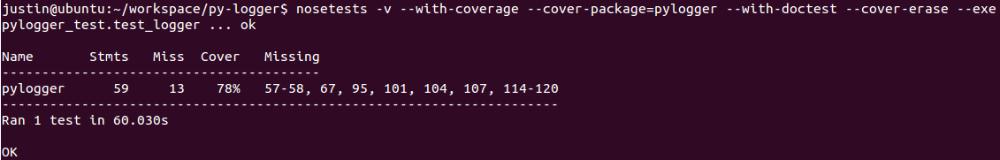
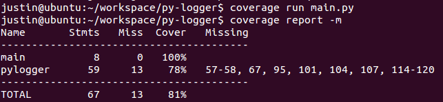

# py-logger

Recently, I want to find an easy-to-use logging wrapper in Python for my project, but none of them is easy enough.
So I write this one.

### Install

	sudo pip install i-pylogger

### Usage
    # import module
    from pylogger import logger
    
    logger.info('hello pylogger')
    
    # modify logger configures any time any times you want
    logger.config(log_dir='another_log', log_file='another_run.log', rotate_max_byte=1024*1024*512, rotate_backup_count=20)
    
    logger.debug('logger config has been modified')
    logger.info('I'm a new log')

    # all log types
    logger.debug('test debug')
    logger.info('test info')
    logger.warn('test warn')
    logger.error('test error')
    logger.critical('test critical')

### Todo
- [x] add modify config functionality
- [x] add unittest(nose with coverage plugin)
- [x] install some CI badges(travis CI, coveralls)
- [x] pubish to PyPI
- [x] add PyPI host documentation

### Unittest
    # unittest
    nosetests
    # unittest with coverage plugin
    nosetests -v --with-coverage --cover-package=pylogger --with-doctest --cover-erase --exe

    # measuring code coverage on with coverage cmd
    coverage run main.py
    coverage report -m

----
*powered by Mou*
